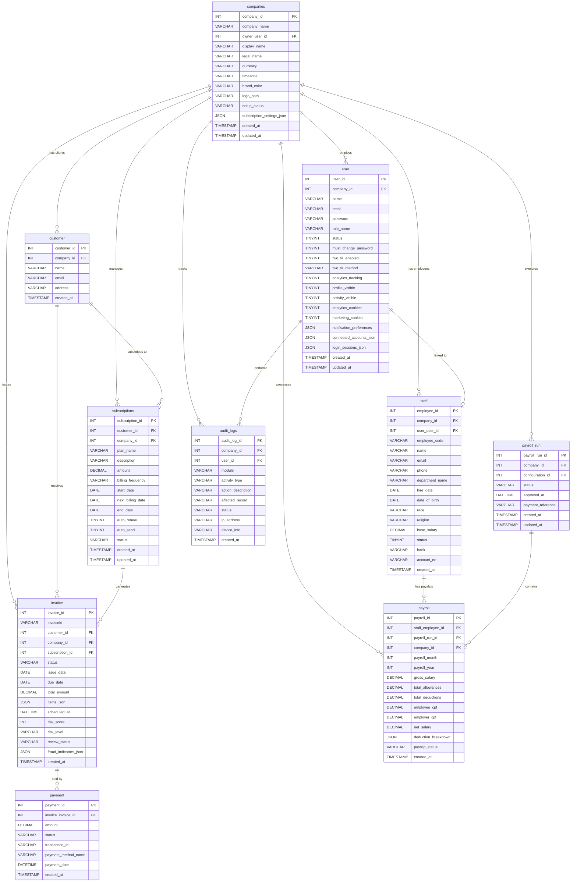

# Entity Relationship Diagram (ERD)

## Top 10 Most Related Tables

## Relationship Summary

| From | To | Type | FK Column |
|------|------|------|-----------|
| companies | user | 1:N | user.company_id |
| companies | staff | 1:N | staff.company_id |
| companies | customer | 1:N | customer.company_id |
| companies | invoice | 1:N | invoice.company_id |
| companies | subscriptions | 1:N | subscriptions.company_id |
| companies | payroll | 1:N | payroll.company_id |
| companies | payroll_run | 1:N | payroll_run.company_id |
| companies | audit_logs | 1:N | audit_logs.company_id |
| user | staff | 1:1 (optional) | staff.user_user_id |
| user | audit_logs | 1:N | audit_logs.user_id |
| customer | invoice | 1:N | invoice.customer_id |
| customer | subscriptions | 1:N | subscriptions.customer_id |
| invoice | payment | 1:N | payment.invoice_invoice_id |
| subscriptions | invoice | 1:N | invoice.subscription_id |
| staff | payroll | 1:N | payroll.staff_employee_id |
| payroll_run | payroll | 1:N | payroll.payroll_run_id |

## Notes

- **Multi-tenant design**: All tables are scoped by `company_id` for tenant isolation.
- **companies** is the central tenant table — all other entities belong to a company.
- **user** and **staff** have an optional 1:1 link (a staff member may or may not have a login account).
- **invoice** items are stored as JSON (`items_json`) on the invoice row for simplicity.
- **subscriptions** automatically generate invoices on billing dates.
- **payment** references the invoice it settles; payment method is stored inline as a name string.
- **payroll_run** groups individual **payroll** records (one per employee per month) into a batch for approval and processing.
