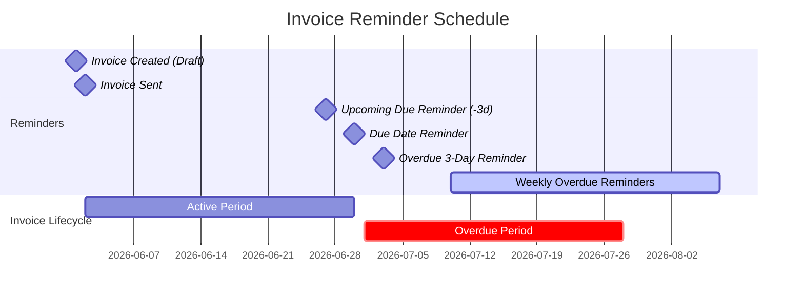
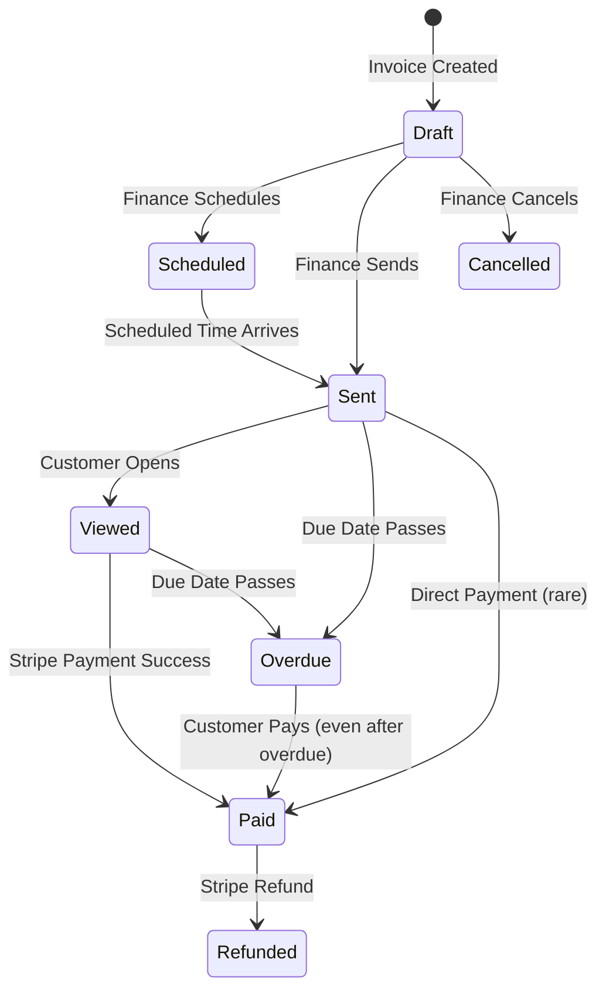

# PayNivo Invoice Payment Workflow

## Complete Workflow Flowchart

```mermaid
flowchart TD
    %% ============ CREATION FLOW ============
    A[Admin Configures Invoice Templates] --> B[Finance Selects Template]
    B --> C[Finance Creates Invoice]
    C --> D{Save as Draft}
    D --> E[Finance Reviews & Edits]
    E --> F{Finance Clicks Send Invoice}

    %% ============ SEND FLOW ============
    F --> G[Create Stripe Checkout Session]
    G --> H[Generate Payment URL]
    H --> I[Generate QR Code]
    I --> J[Generate Invoice PDF]
    J --> K[Send Email to Customer]
    K --> L[Status: Sent]

    %% ============ CUSTOMER FLOW ============
    L --> M[Customer Receives Email]
    M --> N[Customer Opens Invoice]
    N --> O[System Records View]
    O --> P[Status: Viewed]

    %% ============ PAYMENT FLOW ============
    P --> Q{Customer Clicks Pay Now}
    Q --> R[Stripe Checkout Opens]
    R --> S{Payment Method}
    S -->|Credit/Debit Card| T[Process Payment]
    S -->|Apple Pay| T
    S -->|Google Pay| T
    S -->|GrabPay| T
    S -->|PayNow| T

    T --> U{Payment Result}
    U -->|Success| V[Stripe Webhook: checkout.session.completed]
    U -->|Failed| W[Stripe Webhook: payment_intent.payment_failed]

    V --> X[Record Payment in DB]
    X --> Y[Status: Paid]
    Y --> Z[Finance Notification: Payment Received]
    Z --> AA[Customer Receipt Email]

    W --> AB[Finance Notification: Payment Failed]
    AB --> P

    %% ============ OVERDUE FLOW ============
    L --> AC{Due Date Check Daily at 00:05}
    P --> AC
    AC -->|Due Date Passed| AD[Status: Overdue]
    AD --> AE[Finance Notification: Invoice Overdue]

    %% ============ REMINDER FLOW ============
    AE --> AF{Automatic Reminder Schedule}
    AF -->|Every 7 days| AG[Send Overdue Reminder Email]
    AG --> AH[Include Payment Link + QR Code]
    AH --> AI[Log Reminder Sent]
    AI --> AJ[Finance Notification: Reminder Sent]
    AJ --> AK{Customer Pays?}
    AK -->|Yes| V
    AK -->|No| AF

    %% ============ PRE-DUE REMINDERS ============
    L --> AL{3 Days Before Due Date}
    P --> AL
    AL --> AM[Upcoming Due Reminder Email]
    AM --> AN[On Due Date Reminder Email]
    AN --> AO[3 Days After Due Reminder Email]
    AO --> AD

    %% ============ MANUAL INTERVENTION ============
    AD --> AP{Finance Manual Action}
    AP -->|Send Reminder| AG
    AP -->|Record Bank Transfer| AQ[Manual Payment Recorded]
    AQ --> Y

    %% ============ SCHEDULE FLOW ============
    D --> AR{Finance Schedules}
    AR --> AS[Status: Scheduled]
    AS --> AT{Scheduled Time Arrives}
    AT --> G

    %% Styling
    classDef draft fill:#6b7280,color:#fff
    classDef sent fill:#3b82f6,color:#fff
    classDef viewed fill:#06b6d4,color:#fff
    classDef paid fill:#10b981,color:#fff
    classDef overdue fill:#ef4444,color:#fff
    classDef action fill:#7B2FF7,color:#fff

    class D,E draft
    class L,M,N sent
    class P,Q viewed
    class Y,AA paid
    class AD,AE,AF overdue
    class F,G,H,I,J,K action
```

## Pre-Due Reminder Timeline

## Status Transition Diagram

## Automatic vs Manual Reminders: Hybrid Approach

### Recommendation: Hybrid System (Both Automatic + Manual)

**Automatic reminders** handle the routine follow-up efficiently:
- No human effort required for standard reminder cadence
- Consistent timing ensures no invoices are forgotten
- Scales with business growth (100+ invoices per month)
- Professional, templated communication

**Manual reminders** are essential for:
- High-value invoices requiring personal attention
- Customers with special circumstances (payment plans)
- Escalation when automatic reminders haven't worked
- Relationship-sensitive accounts
- Custom messaging for specific situations

### Current Implementation

| Feature | Automatic | Manual |
|---------|-----------|--------|
| 3 days before due | ✅ Automatic | ❌ |
| On due date | ✅ Automatic | ❌ |
| 3 days after due | ✅ Automatic | ❌ |
| Every 7 days overdue | ✅ Automatic | ❌ |
| Custom message | ❌ | ✅ Finance can trigger |
| Payment link included | ✅ | ✅ |
| QR code included | ✅ | ✅ |
| Stops when paid | ✅ | N/A |
| Logged in audit trail | ✅ | ✅ |
| Finance notified | ✅ | ✅ |

### Best Practice

Run automatic reminders as the baseline system. Finance users see reminder history in the dashboard and can manually send additional reminders when needed. The system prevents duplicate automatic reminders but allows Finance to send manual reminders at any time for escalation purposes.
